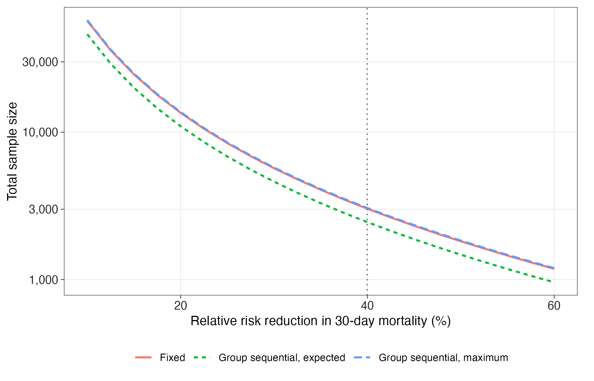
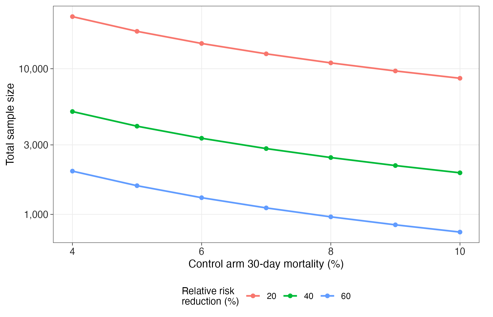
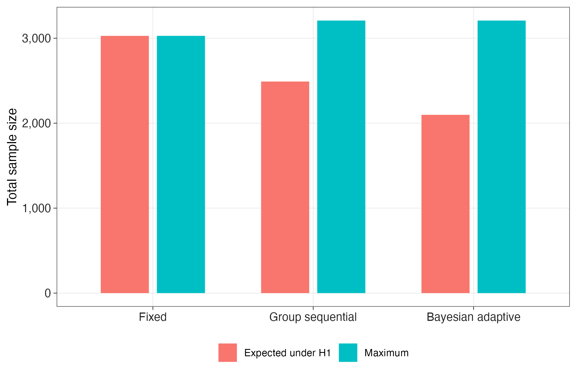
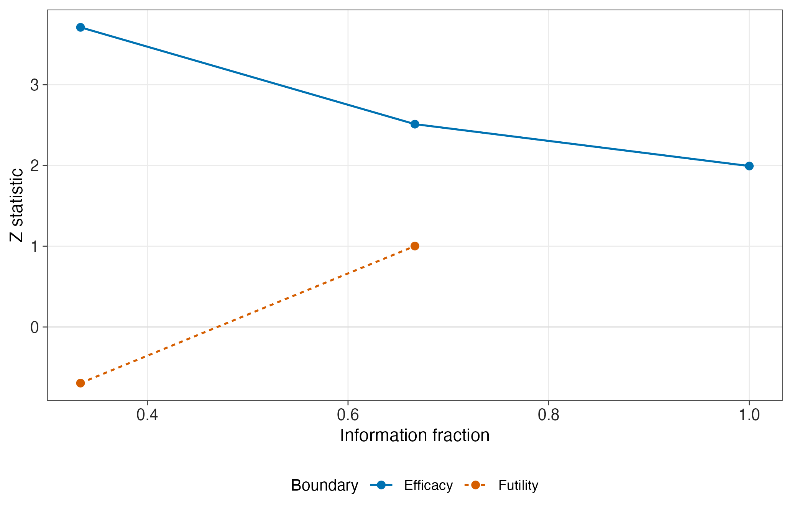
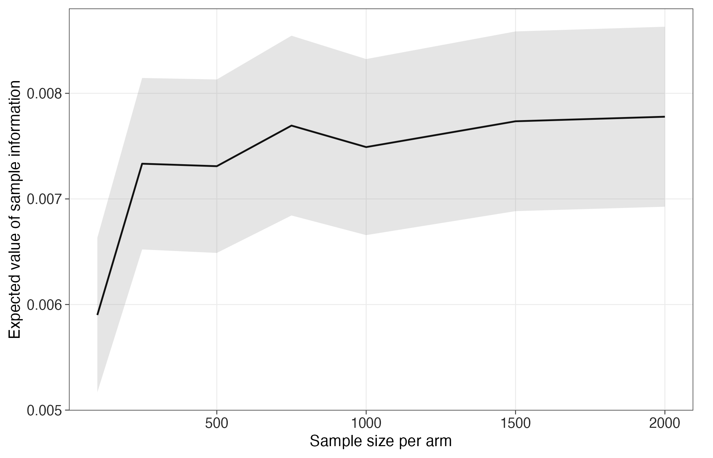

# Designing the definitive trial of ERCP timing in acute cholangitis

Results of the simulation study specified in [ADEMP.md](ADEMP.md), which was written before the study
was run. Reproduce with:

```bash
Rscript analysis/ercp_flagship/run_flagship.R
```

A caveat on that claim, stated here rather than left for a reader to discover. The protocol was
written first, but it entered the repository in the same commit as the results (303fc3f), so the
public history cannot corroborate the ordering, and a pre-registration that rests only on the
author's word is not a pre-registration. No external timestamp anchor was lodged. Future studies in
this repository will commit the protocol on its own and register it externally before anything is
run. Treat the protocol adherence recorded below as an honest account rather than as an independently
verified one.

Seed 20260727, 10,000 replications for the design comparison, 5,000 for the Bayesian calibration,
2,000 for the prognostic-adjustment aim. Session details in `results/session_info.txt`. All tables
below are written to `results/` by that script; no number in this document was typed by hand.

---

## Summary

The definitive trial needs roughly **3,000 patients**, an order of magnitude more than the 304 in the
largest existing randomised trial. Adaptive designs reduce the *expected* sample size by 18 to 31
percent but not the maximum, and the group-sequential design buys that saving at the cost of a
biased treatment-effect estimate and confidence intervals that undercover. A prognostic covariate
recovers about 8 percent of the sample size without disturbing the type I error rate.

The most consequential result is the mismatch between the two ways of asking how large the trial
should be. Powered conventionally, it needs about 3,000 patients. Judged by how much of the available
decision value it actually captures, a trial of **500 patients already delivers 92 percent** of what
perfect information would be worth, and going from 500 to 4,000 adds about six percentage points.
A trial sized for statistical convention and a trial sized for the decision are not the same trial,
and the gap between them is large enough to change what should be proposed.

---

## A1. How large does the trial have to be?

Total sample size for 90 percent power at a one-sided alpha of 0.025, against 30-day mortality of
6.58 percent in the early-ERCP arm.

| Relative risk reduction | Urgent-arm mortality | Fixed design | Group sequential, maximum | Group sequential, expected under H1 |
|---|---|---|---|---|
| 10% | 5.92% | 56,884 | 57,560 | 46,160 |
| 20% | 5.26% | 13,518 | 13,678 | 10,968 |
| 30% | 4.61% | 5,692 | 5,760 | 4,618 |
| **40%** | **3.95%** | **3,022** | **3,058** | **2,452** |
| 50% | 3.29% | 1,818 | 1,840 | 1,475 |
| 60% | 2.63% | 1,182 | 1,196 | 958 |

The anchoring trial (Jagtap et al., *Gut* 2026) observed a 40 percent relative reduction in 30-day
mortality, which is the highlighted row. Confirming an effect of that size takes about 3,000
patients; the trial that observed it enrolled 304. Its confidence interval (HR 0.70, 95% CI 0.25 to
1.93) was not an unlucky result, it is what a trial of that size produces for an outcome this rare.

Sample size is brutally sensitive to the true effect. Halving the assumed benefit from 40 percent to
20 percent multiplies the requirement by 4.5. Anyone proposing this trial is implicitly betting on
an effect size, and the honest range spans from feasible to impossible.

**Sensitivity to the control rate.** The 6.58 percent control mortality is itself estimated from 152
patients, so it is worth knowing how much rides on it. At a fixed 40 percent relative reduction:

| Control mortality | 4% | 5% | 6% | 7% | 8% | 9% | 10% |
|---|---|---|---|---|---|---|---|
| Total sample size | 5,082 | 4,032 | 3,332 | 2,830 | 2,456 | 2,164 | 1,930 |

Recruiting a sicker population makes the trial dramatically smaller. This is a design lever, not just
a nuisance parameter: enriching for higher-risk cholangitis is the single most effective way to make
this trial feasible, and it is worth more than any adaptive design considered below. It also narrows
the population the result applies to, which is the trade-off to argue about.



**Figure 1.** Total sample size required for 90 percent power against the assumed relative risk
reduction in 30-day mortality, on a logarithmic scale, for the fixed design and for the maximum and
expected sizes of a three-analysis group-sequential design. The dotted vertical line marks the effect
observed in the anchoring trial.



**Figure 2.** Total sample size for the fixed design against the assumed control-arm 30-day mortality,
at relative risk reductions of 20, 40 and 60 percent.

---

## A2. Which design?

All three designs target the same alternative. The group-sequential design uses three equally spaced
analyses with O'Brien-Fleming alpha spending and a non-binding O'Brien-Fleming futility boundary. The
Bayesian design uses independent Beta(1,1) priors, three analyses, a futility threshold of 0.10, and
an efficacy threshold calibrated by simulation to 0.9895 so that its type I error matches 0.025.

| Design | Maximum n | Power | Type I error | Expected n under H1 | Expected n under H0 |
|---|---|---|---|---|---|
| Fixed | 3,028 | 0.903 (0.003) | 0.0244 (0.0015) | 3,028 | 3,028 |
| Group sequential | 3,208 | 0.904 (0.003) | 0.0227 (0.0015) | 2,490 (6) | 2,033 (7) |
| Bayesian adaptive | 3,208 | 0.874 (0.005) | 0.0246 (0.0022) | 2,098 | 2,913 |

Monte Carlo standard errors in parentheses.

Both adaptive designs cost about 6 percent in maximum sample size, which is what has to be budgeted
and recruited for. What they return differs in a way that matters for which one to propose.

The group-sequential design stops early in 63 percent of trials under the alternative and 85 percent
under the null, giving an expected 2,490 and 2,033 patients respectively. Its behaviour under the
null is the valuable part: if urgent ERCP does not work, the trial stops after about two thirds of
the planned enrolment.

The Bayesian design is the reverse. It is the most efficient of the three when the treatment works
(expected 2,098, a 31 percent saving on the fixed design) and the least efficient when it does not
(expected 2,913). Its futility threshold of 0.10 is simply less aggressive than the O'Brien-Fleming
beta-spending boundary. It also loses about 3 percentage points of power at the same maximum size.
That is not an argument against Bayesian designs in general; it is an argument that this particular
threshold pair was calibrated for type I error and not tuned for futility, and tuning it is
straightforward.

Which to prefer depends on a question the simulation cannot answer: whether the sponsor is more
worried about wasting patients on a treatment that does not work, or about carrying a large trial to
completion when it does. The group-sequential design is better on the first, the Bayesian design on
the second.



**Figure 3.** Maximum and expected total sample size for the three designs, expected size computed
under the design alternative.



**Figure 4.** Efficacy and futility stopping boundaries on the z scale against information fraction
for the three-analysis group-sequential design.

### The cost of stopping early, which is easy to miss

| Design and scenario | Bias | Coverage of nominal 95% interval |
|---|---|---|
| Fixed, under H1 | -0.00004 (0.00008) | 0.946 (0.002) |
| Fixed, under H0 | 0.00009 (0.00009) | 0.948 (0.002) |
| Group sequential, under H1 | **-0.00131 (0.00010)** | **0.928 (0.003)** |
| Group sequential, under H0 | 0.00324 (0.00012) | 0.948 (0.002) |

The fixed design's estimator is unbiased and its intervals cover at the nominal rate, as they should.
The group-sequential design's naive estimator is not. Its bias under the alternative is more than
twelve Monte Carlo standard errors from zero, in the direction of overstating the benefit, and its
naive confidence interval covers 92.8 percent of the time rather than 95.

This is a known consequence of stopping on a boundary rather than a defect in the design, and it is
the reason median-unbiased estimation and stagewise-ordering intervals exist. It appears here because
the ADEMP framework requires reporting bias and coverage rather than power alone. A protocol that
adopts a group-sequential design and then reports a naive point estimate and interval will overstate
the effect, and the pre-specified analysis plan should say which adjusted estimator will be used.

---

## A3. Does a prognostic covariate help?

A PROCOVA-style analysis, in which a prognostic score trained on 5,000 simulated historical control
patients enters the trial analysis as a pre-specified covariate. Four correlated baseline covariates
(age, bilirubin, a severity score, organ dysfunction at presentation) generate the outcome.

| Quantity | Estimate | Monte Carlo SE |
|---|---|---|
| Ratio of adjusted to unadjusted standard error | 0.920 | 0.0007 |
| Implied sample-size reduction | 8.0% | 0.07% |
| Type I error, unadjusted | 0.030 | 0.0038 |
| Type I error, adjusted | 0.024 | 0.0034 |
| Power, unadjusted | 0.457 | 0.011 |
| Power, adjusted | 0.483 | 0.011 |

Adjustment does not inflate the type I error rate. The adjusted estimate of 0.024 sits within a third
of a Monte Carlo standard error of the nominal 0.025 and below the unadjusted 0.030, which is the
property that makes this method usable: randomisation is untouched, so only the residual variance
changes. The unadjusted estimate is 1.2 Monte Carlo standard errors above nominal, which is ordinary
sampling variation rather than a finding.

The 8 percent sample-size reduction is real but modest, and it sits at the low end of the 10 to 30
percent range reported for PROCOVA. That is expected and should not be oversold. The gain depends
entirely on how prognostic the score is, and the covariate structure used here is illustrative rather
than estimated from data. Applied to the 3,028-patient trial, 8 percent is roughly 240 patients,
which is worth having but does not change feasibility.

Two caveats, and the second is the more important.

First, the covariate correlations and coefficients here were chosen to be plausible, not fitted to a
cholangitis cohort. Replacing them with real aggregate estimates would move this number in either
direction, and doing so is exactly what an external parameter pack is for.

Second, and this bounds the result in one direction: the prognostic model in these simulations is
fitted on exactly the covariates that generate the outcome. It is correctly specified by
construction. A real prognostic model is misspecified relative to the true outcome process, so it
discriminates worse and the variance reduction is smaller. **The 8 percent figure is therefore an
upper bound under ideal conditions, not a forecast.**

**This result should be read as a demonstration that the machinery works and preserves the type I
error rate, not as an estimate of what prognostic adjustment would deliver in this disease.**

These simulations used 500 patients per arm rather than the full 1,514, because each replicate fits
two generalised linear models. The variance-reduction factor is a property of the covariate's
prognostic strength rather than of sample size, so it transfers, but the power figures in the table
are the power of the smaller trial and should not be compared with the A2 table.

---

## A4. Is the trial worth running at all?

Value of information analysis on a prior for the log relative risk taken directly from the anchoring
trial's reported hazard ratio of 0.70 (95% CI 0.25 to 1.93). Net benefit counts one death averted as
1 and charges 0.05 per additional procedure-related adverse event, using the excess adverse-event
rate of 7.9 percentage points that trial observed. Early ERCP is the reference and scores zero.

Under this prior, urgent ERCP is the better choice for **71.0 percent** of draws, so current evidence
already leans towards it, but not decisively. Expected value of perfect information is **0.0080
deaths-equivalent per patient** (Monte Carlo SE 0.00014).

| Patients per arm | 100 | 250 | 500 | 750 | 1,000 | 1,500 | 2,000 |
|---|---|---|---|---|---|---|---|
| EVSI | 0.0059 | 0.0073 | 0.0073 | 0.0077 | 0.0075 | 0.0077 | 0.0078 |
| Share of EVPI | 74% | 92% | 91% | 96% | 93% | 97% | 97% |

Monte Carlo standard errors are about 0.0004 throughout, which is why the curve is not perfectly
monotonic; the dips at 500 and 1,000 patients per arm are noise, not signal, and should not be
interpreted.

The shape is the finding. A trial of 250 patients per arm already captures 92 percent of the
available decision value, and quadrupling it to 1,000 per arm adds one or two percentage points. The
information content of this trial saturates far below the size that conventional power calculations
demand.

That is not an argument for running an underpowered trial. Power and decision value answer different
questions, and a 500-patient trial that captures most of the decision value will still produce a
confidence interval too wide to persuade a guideline committee, which is a real cost this net-benefit
function does not price. But it does mean the 3,000-patient figure should be defended on the grounds
of what will convince the field, not on the grounds that fewer patients would leave the decision
unresolved. On the evidence here, it largely would not.

Scaled to a population of 100,000 cases a year over a ten-year horizon discounted at 3 percent, the
best trial in the grid is worth about **6,834 deaths-equivalent**. Every number in this section
inherits the net-benefit function above, which is a judgement rather than a measurement; a different
weighting of procedural harm against mortality would move all of it.



**Figure 5.** Expected value of sample information against trial size, with a Monte Carlo uncertainty
ribbon. The horizontal line marks the expected value of perfect information.

---

## A5. Validation

No design quantity here was computed by hand where an established engine provides it.

**Cross-engine agreement.** Group-sequential boundaries from rpact were compared against gsDesign for
O'Brien-Fleming and Pocock boundaries, classical and alpha-spending, at two through five analyses.
All sixteen configurations agree, with a largest absolute difference of **9.3e-07** on the z scale
(`results/benchmark_rpact_vs_gsdesign.csv`).

**Simulator against analytic power.** At the fixed design's sample size, simulated power was 0.9032
(Monte Carlo SE 0.0030) against rpact's analytic 0.9001, a difference of 1.04 Monte Carlo standard
errors at this number of replications.

That comparison alone would overstate the agreement, so it is worth stating what a larger check
shows. Repeated at 200,000 replications across five scenarios, the simulator sits **consistently
above** rpact, by 0.3 to 0.7 percentage points, with the sign always positive:

| Control / treatment rate | n per arm | rpact analytic | Simulated | Difference | In Monte Carlo SEs |
|---|---|---|---|---|---|
| 0.30 / 0.15 | 161 | 0.9004 | 0.9035 | +0.0031 | 4.8 |
| 0.20 / 0.10 | 266 | 0.9002 | 0.9071 | +0.0070 | 10.7 |
| 0.10 / 0.05 | 582 | 0.9005 | 0.9052 | +0.0048 | 7.3 |
| 0.50 / 0.35 | 227 | 0.9011 | 0.9042 | +0.0031 | 4.7 |
| 0.0658 / 0.0395 | 1,514 | 0.9001 | 0.9040 | +0.0039 | 5.8 |

This is a systematic difference, not Monte Carlo noise, and it is not a defect in either tool. rpact
evaluates a normal-approximation formula; the simulator simulates the actual discrete binomial test.
(rpact implements only the normal approximation for two-group rate comparisons, so this is not a
settings difference.) The two therefore differ by about the amount the normal approximation is off,
which at these designs is under half a percentage point.

The honest reading is that the simulator reproduces rpact **to within about 0.01 on the probability
scale, biased slightly high**, rather than agreeing to within Monte Carlo error. That bound is what
justifies trusting the simulator for the Bayesian design, where no analytic result exists, and it is
small relative to the differences between designs that this study reports. It also means the power
figures in the A2 table are likely optimistic by a few tenths of a percentage point, which does not
change any conclusion here but should not be silently ignored.

**Type I error.** Simulating under the null recovered 0.0244 (Monte Carlo SE 0.0015) against a
nominal 0.025 for the fixed design, and the Bayesian design's calibrated threshold achieved 0.0246
(0.0022).

**Estimator behaviour.** Bias and coverage were checked for every design rather than assumed, which
is how the group-sequential undercoverage in A2 was found.

---

## Deviations from the protocol

Four, all recorded here rather than silently absorbed.

0. The first published version of this report ran the prognostic-adjustment aim at 1,000 repetitions
   rather than the 2,000 the protocol specifies, and did not record the change. It was found in a
   later audit and the aim has been re-run at the pre-specified 2,000; the table in A3 is the re-run.
   The correction moved the adjusted type I error from 0.020 to 0.024 and the unadjusted from 0.023
   to 0.030, and left the standard-error ratio unchanged at 0.920. Recording it here rather than
   quietly republishing is the whole point of having a protocol.

1. The protocol specified a prior for the value-of-information analysis without fixing its scale. The
   analysis places the prior on the log relative risk rather than on the risk difference, so that
   every draw implies an event rate that is a valid probability. An initial run placed it on the risk
   difference and had to clip 475 of 20,000 draws, which would have biased the EVSI; the final run
   clips none.
2. The prognostic-adjustment aim was run at 500 patients per arm rather than the definitive trial's
   1,514, for the runtime reason given in A3. The protocol did not specify a size for this aim.
3. The protocol anticipated reporting expected sample size for the Bayesian design under both
   hypotheses, which is done, but its stopping probabilities by look are recorded in
   `results/a2c_bayesian_looks.csv` rather than tabulated here.

## What this study cannot tell you

Patients arrive as independent draws with no site structure, no accrual model and no dropout. Real
multi-centre accrual would raise every sample size here through between-site heterogeneity, and
realistic accrual and case-volume parameters would have to come from sources that cannot be published
in this repository, which is what the external parameter-pack mechanism exists for.

The estimand is 30-day all-cause mortality under a treatment-policy strategy. Crossover for clinical
deterioration and rescue drainage are named in the parameter pack as intercurrent events but are not
yet simulated as such; adding them would reduce the observed contrast between arms and increase the
required sample size, so the numbers here are optimistic in that specific direction.

The safety estimand is not powered. The anchoring trial's one significant finding was that urgent
ERCP caused more procedure-related adverse events, and a definitive trial that establishes a mortality
benefit while leaving that harm imprecisely estimated will not settle the clinical question. Designing
for both endpoints jointly is the obvious next piece of work.

Finally, the population is mild-to-moderate cholangitis, following the anchoring trial. Severe
cholangitis, where equipoise about delaying drainage is weakest, is outside every number above.
